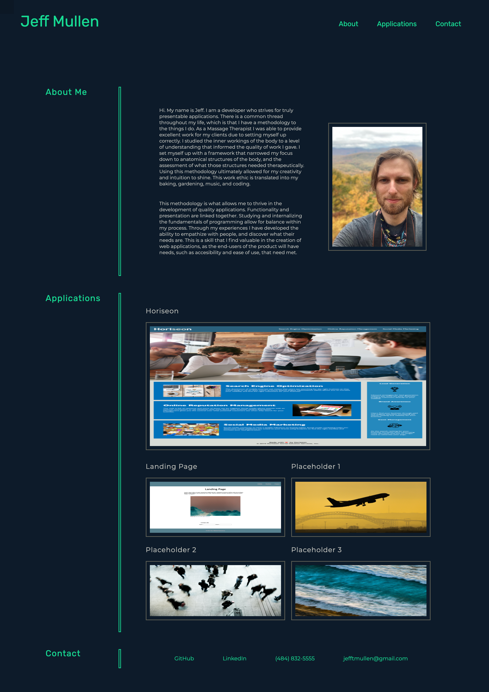

# Portfolio

## This application is a portfolio to display the history of my work as a developer.

* The live [web application](https://jeffmullen.github.io/portfolio/).

## Thought Process

* This application is designed to have a modern look that is easy on the eyes.  

    * The use of a dark background prevents harsh light for the user.  

* The nav bar contains links that will scroll to each respective section of the page.

* A recent photo of myself is provided.

* The first and second applications are linked to **deployed** GitHub pages.

    * The remaining applications are placeholders until I have developed more projects.  

* The first application is largest in size and is the most developed product.

* This webpage is responsive to a variety of screen sizes.

## Webpage

